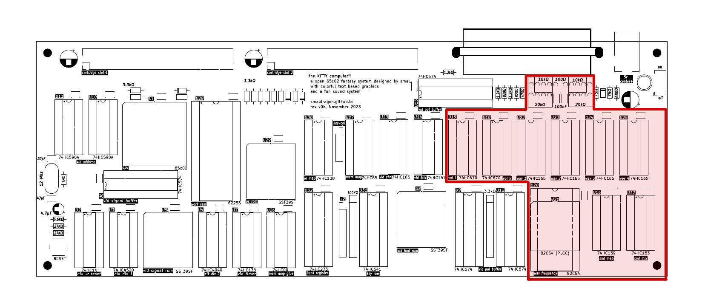
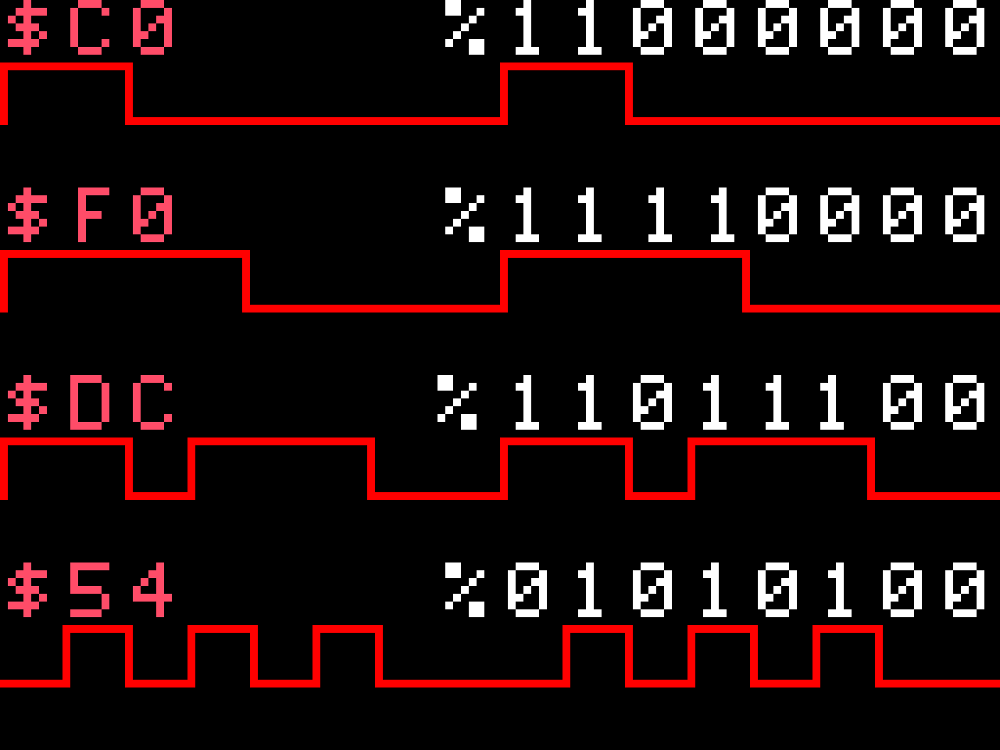

# Audio System

| Address | Mode | Description |
|---------|------|-------------|
| `$70E0` | R/W  | Wave 1 Frequency |
| `$70E0` | R/W  | Wave 2 Frequency |
| `$70E0` | R/W  | Wave 3 Frequency |
| `$70E3` | R/W  | Wave Frequency Control (must write to here first) |
| `$70F0` |  W   | Wave 1 Volume |
| `$70F1` |  W   | Wave 2 Volume |
| `$70F2` |  W   | Wave 3 Volume |
| `$70F3` |  W   | Wave 4 Volume |
| `$70F4` |  W   | Wave 1 Waveform |
| `$70F5` |  W   | Wave 2 Waveform |
| `$70F6` |  W   | Wave 3 Waveform |
| `$70F7` |  W   | Wave 4 Waveform |

## Setting the volume

The volume registers (`$70F0-$70F3`) allow you to set the current volume of each wave for both the left and right audio channels.

Volume is defined by a writing single byte to the register, wherin the upper nibble defines the volume for the left channel and the lower nibble defines the volume of the right nibble. By writing different volume values on every frame the programmer can achieve smooth volume envelopes and panning effects. So for example the value `$F8` would output a wave at max value on the left speaker and at half volume on the right speaker.

In hardware 2 `74hc670` 4x4bit registers hold the left and right volumes of each channel, and are each connected to one of the two audio DACs (left and right).

## Setting a Waveform

The waveform registers (`$70F4-$70F7`) allow you to set a unique "timbre" to be used by each wave. 

The waveform is defined by writing a single byte to the register, where each bit is interpreted as either a low (0) or high (1) in the waveform. So for example writing the value `$F0` (`%11110000`) would create a simple square wave, while `$C0` (`%11000000`) would generate a 25% duty pulse wave. By playing around with values its possible to make a wide array of interesting sounds.

In hardware 4 `74hc165` shift-registers hold each waveform and are clocked in a self-feeding fashion in order to produce sound.

## Setting the Frequency (notes)

The frequency of the melodic channels (1-3) are controlled by a `82c54` tripple timer at `$70E0-$70E3`, this a chip also found in the original IBM PC to control its beeper (along with other non-sound functions). Its programming is unfortunately a bit unintuitive compared to the other sound registers but I will try and explain it here as best I can.

Register 
`%01_11_010_0`
