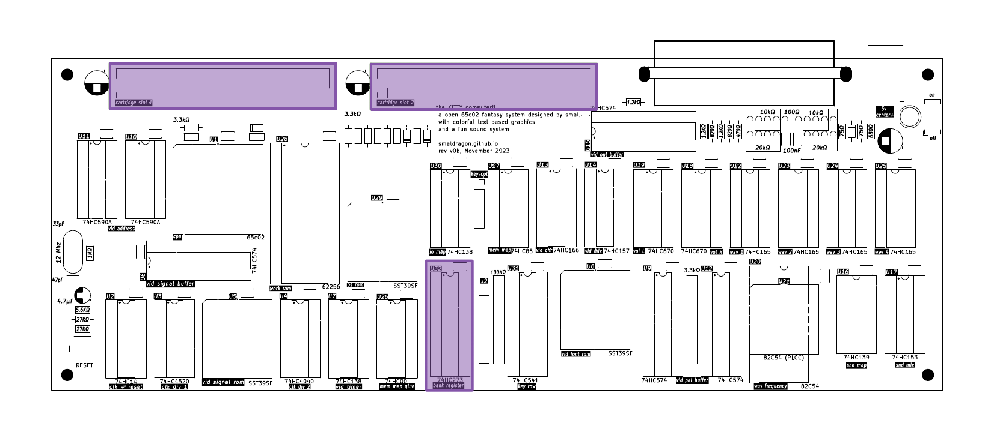

# Cartridges and Memory

| Address | Mode |  Description   | Format     |
|---------|------|----------------|----------------------------------|
| `$0000-$6FFF`| R/W | System Ram | 28Kb of static ram |
| `$70D0` |  W   | BANK Register  | `%cccc_bbbb` **c**artridge `0-1` and **b**ank `0-127` |
| `$8000-$FFFF` | R/W | Cartridge Space | 32Kb banked window

Cartridges are the main form of media and expansion used by the KITTY, with the system being able to hold 2 cartridges at a time (cart 1 and cart 2), each holding a 4Mb address space, that can be filled with programs, extra ram or peripheral devices.

They are accessed through the upper half of the KITTY memory map (`$8000-$FFFF`), which acts as 32Kb window into the contents of one of the 2 carts. This window can then be controlled by writing to the BANK register located at `$70D0`. The upper bit will determine the cartridge, while the 7 remaining bits will select one of up to 128 banks within it.

Finally, on harware reset/power-on the BANK register will always be cleared to $00. The cpu will always begin code execution from the first bank of the first cartridge.