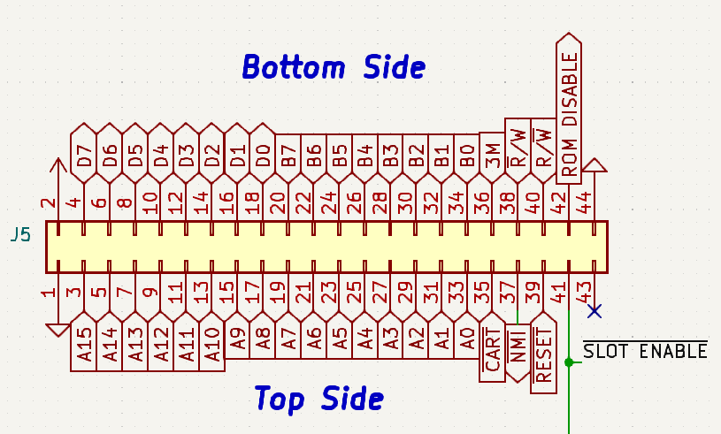

# Cartridges and Memory

| Address | Mode |  Description   | Format     |
|---------|------|----------------|----------------------------------|
| `$0000-$6FFF`| R/W | System Ram | 28Kb of static ram |
| `$70D0` |  W   | BANK Register  | `%cccc_bbbb` **c**artridge `0-1` and **b**ank `0-127` |
| `$8000-$FFFF` | R/W | Cartridge Space | 32Kb banked window

Cartridges are the main form of media and expansion used by the KITTY, with the system being able to hold 2 cartridges at a time (dubbed Slot 1 and Slot 2), each of which have an individual 4Mb address space, that can be filled with programs, extra ram or peripheral devices.

They are accessed through the upper half of the KITTY memory map (`$8000-$FFFF`), which acts as 32Kb window into the contents of one of the 2 carts. This window can then be controlled by writing to the BANK register located at `$70D0`. The upper bit will determine the cartridge, while the 7 remaining bits will select one of up to 128 banks within it.

Finally, on hardware reset/power-on the BANK register will always be cleared to $00. As such, CPU will always begin code execution from the Bank 0 of Slot 1.

## OS ROM

The "OS ROM" or "TEST ROM" is a rom present on the main KITTY PCB, which is virtuaslly mapped to cartridge Slot 1. As of time of writing (2024-01-05), the contents of this chip have not been defined.

## Cartridge Pinout

The 2 cartridge slots use standard right-angle edge connectors, with 44-pins, and a spacing of 2.54mm (0.1"):

* `D0-D7`  - 8bit data bus
* `A0-A15` - 16bit address bus
* `B0-B7`  - 8bit BANK register
* `M3`     - 3Mhz Bus Clock
* `R/#W`   - Read/Write Signal, standard 65xx polarity
* `#R/W`   - Read/Write Signal, inverted polarity
* `#RESET` - System Reset
* `#NMI`   - Non-Maskable Interrupt
* `#CART`  - Cartridge Space Access `A15 NAND M3`
* `#SLOT ENABLE`- If the current slot is enabled (according to bit 7 of BANK)
* `ROM DISABLE` - Disable OS ROM (slot 1 only)
* `x` - Unconnected

`ROM DISABLE` is a signal that, when pulled high by a cartridge in Slot 1, disables the OS ROM. A cart can choose to leave this signal permanently high, to completely replace the OS ROM, or it can instead choose to implement more complex address decoding logic, allowing both to coexist within the same slot.