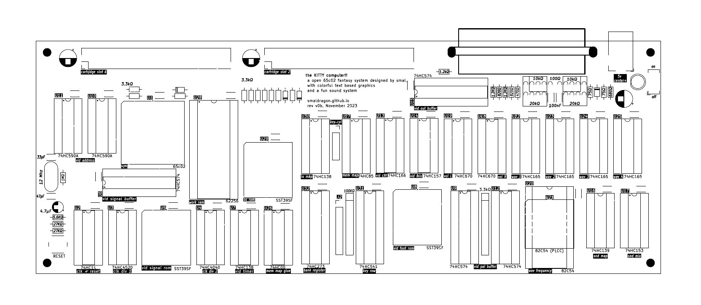
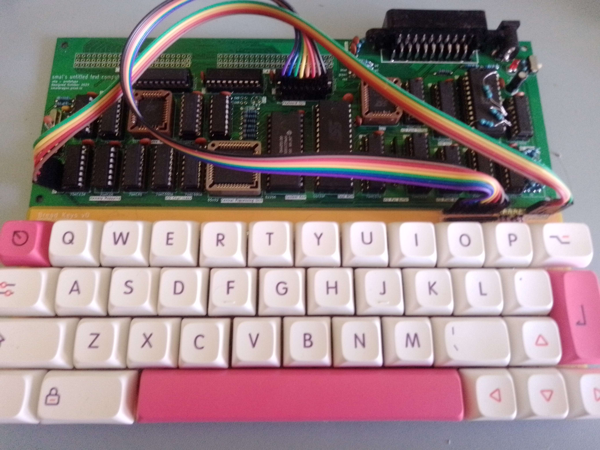

# What is a KITTY? (an introduction)

The **KITTY** (Kewl Interactive Text Terminal sYstem) is a new 8bit 65c02-based fantasy homebrew computer developed by smal (that's me!), it envisions a microcomputer which never existed, with colorful text based graphics, an unique sound system and, oddly, cartridges as its main form of media and expansion.

Looking at the back of the system, we see an austere sight: An audio/video SCART port and two cartridge ports, and not a single peripheral port in sight! In fact, the basic cartridge that came bundled with every sold system had to include audio jacks on the cart itself in order to allow one to save their programs. Rather than a failure, this was the driving design philosphy behind the cost-saving design of the KITTY, to allow programs to come bundled with any extra features they might need, while leaving the base design unburdened, after all, what use would an extra port or feature be without an accompaning program to use it?

Sadly we do not have access to this particular alternate reality (perhaps because it is imaginary), so we can not judge the success of this particular design approach. However, I have designed and built a version of this system here in our own world for anyone to play with, and this is what this manual is all about.

I wish you a fun and (hopefully) educational time exploring this little system

> The original v0a board prototype

## Details

The current iteration of the KITTY board (v1a) uses only in-production parts and is open hardware that anyone can tweak and build upon, on the v1a board custom features like video and audio are all implemented through the means of discrete 74-series logic. All ICs are in either Dual-In-Line packages or PLCC packages using through hole sockets, so that no surface mount soldering is required for assembly and all ICs can be easily placed or removed.

Finally, all components, their values, and their general function within the circuit are written on the silkscreen itself, as I wanted a board that was easy to assemble and understand.

## SPECS

* **CPU** 65c02 @ ~2.2mhz (3mhz bus)
* **RAM** 28Kb Static Ram
* **MEDIA** 2 cartridge slots for programs or expansion, each with up to 128 banks of 32kb for a theoretical max of 4Mb per cartridge
* **VIDEO** Custom, 8x8 pixel characters on a 32x32 grid, selectable background/foreground colors from a pallette of 16 
* **AUDIO** Custom, 4 channels of 8x1 wavetable audio (3 melodic, 1 percussive), with 4bit+4bit stereo volume control
* **INPUT** Custom 40-key mechanical keyboard 
* **OUTPUT** SCART, using RGB progressive PAL @50.1hz
* **POWER** 5v DC via a center positive barrel jack