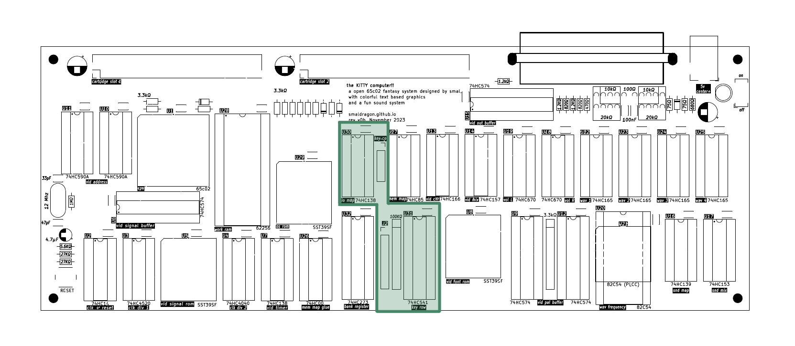
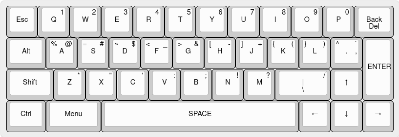

# Keyboard

The KITTY uses a custom 40-key mechanical keyboard for input, which is connected to the main board via two cables.

The keyboard can be read directly by the cpu through means of 5 Keyboard Row Registers, where each bit in the byte represents the current state of a particular key (**0**=unpressed **1**=pressed).

| Address | Mode |  Description   | Keys (highest to lowest bit)|
|---------|------|----------------|-----------------------------|
| `$7000` |  R   | Keyboard Row 1 |                             |
| `$7010` |  R   | Keyboard Row 2 |                             |
| `$7020` |  R   | Keyboard Row 3 |                             |
| `$7030` |  R   | Keyboard Row 4 |                             |
| `$7040` |  R   | Keyboard Row 5 |                             |