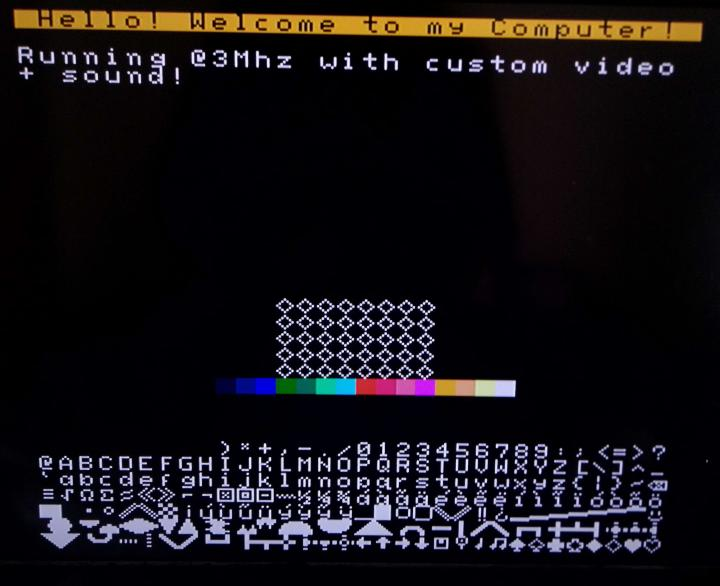
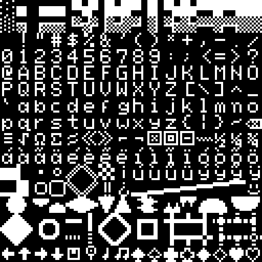

# Video System

The KITTY's video output is a text based display containing 32 by 32 tiles of 8 by 8 pixels. Each tile can be set to one of 256 different characters from a fixed font, with foreground and background colors chosen from a palette of 16.

The data for the display is located directly in system ram:

| Address |  Description       | Format                                |
|---------|--------------------|---------------------------------------|
| `$6800-$6BFF` | Display Color      | `%ffff_bbbb` **f**oreground and **b**ackground |
| `$6C00-$6FFF` | Display Characters | `0-255` extended ascii character      |

## Palette

An approximation of the KITTY's color palette:

## Font

The font is a variation of ascii:

