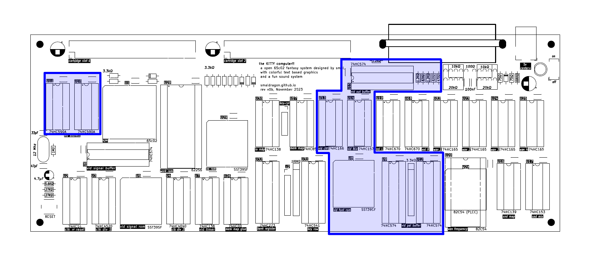

# Video System

The KITTY's video output is a text based display containing 32 by 32 tiles of 8 by 8 pixels. Each tile can be set to one of 256 different characters from a fixed font, with foreground and background colors chosen from a palette of 16 colors.

The data for the display is located directly in system ram:

| Address | Size |  Description       | Format                                |
|---------|------|--------------------|---------------------------------------|
| `$6800` | 1024 | Display Color      | `%ffffbbbb` foreground and background |
| `$6C00` | 1024 | Display Characters | `0-255` extended ascii font           |

## Palette

## Font