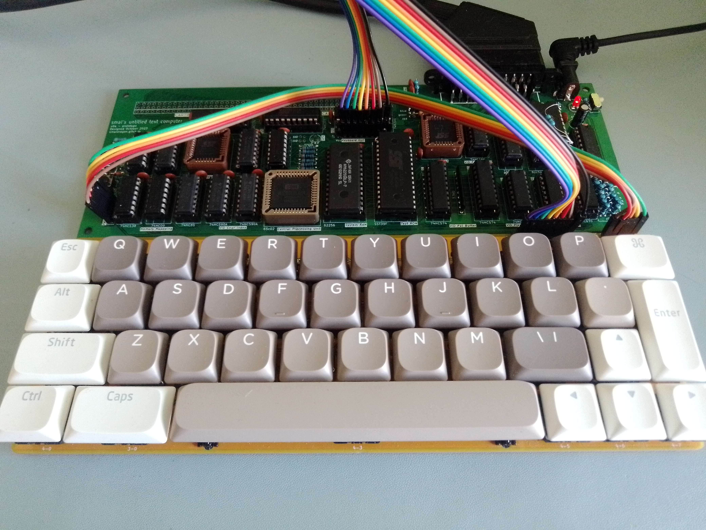

# KITTY Computer

KITTY is a 65c02 Homebrew Home Computer designed around text mode graphics and cartridge media.

* **Bus Speed:** 3Mhz
* **CPU:*** w65c02s @~2.2Mhz (average)
* **RAM:** 28Kb SRAM
* **Video:** Custom, 256x256pixels, a text mode display using a preset font, 32x32 8x8 pixel characters, 16 color palette
* **Sound:** Custom, 3 Channels of Square Waves and 1 "percussion" channel, 4bit+4bit stereo volume control.
* **Input:** 40-Key Mechanical Keyboard
* **Media/Expansion:** 2 Cartridge Slots, each with up to 128x32Kb banks.
* **Interrupts:** /IRQ triggered when the video circuit has drawn the last visible pixels on the frame.
* **Output:** RGB PAL (50hz), via a SCART connector.

**[Schematics](schematics.md)**

## Memory Map
Address  | Function | Size (Kb)
---------|----------|-----
**$0000-6FFF**    | Work Ram | 28Kb
**$6800-6BFF**    | Palette Memory | 1Kb
**$6C00-6FFF**    | Character Memory | 1Kb
**$7000-7FFF**    | IO       | 4Kb
**$8000-FFFF**    | Cartridge Space (controled by BANK Register) | 32Kb

## IO Registers

Address  | Function | Mode | Bits
---------|---|--------|-----|
**$7000**| Keyboard Row 1 | R | <kbd>O</kbd> <kbd>I</kbd> <kbd>U</kbd> <kbd>T</kbd> <kbd>R</kbd> <kbd>E</kbd> <kbd>W</kbd> <kbd>Esc</kbd>
**$7010**| Keyboard Row 2 | R | <kbd>P</kbd> <kbd>K</kbd> <kbd>J</kbd> <kbd>Y</kbd> <kbd>G</kbd> <kbd>S</kbd> <kbd>Q</kbd> <kbd>Alt</kbd>
**$7020**| Keyboard Row 3 | R | <kbd>Backspace</kbd> <kbd>L</kbd> <kbd>M</kbd> <kbd>H</kbd> <kbd>V</kbd> <kbd>D</kbd> <kbd>A</kbd> <kbd>Shift</kbd>
**$7030**| Keyboard Row 4 | R | <kbd>Enter</kbd> <kbd>.</kbd> <kbd>\\|</kbd> <kbd>N</kbd> <kbd>B</kbd> <kbd>F</kbd> <kbd>Z</kbd> <kbd>Caps</kbd>
**$7040**| Keyboard Row 5 | R | <kbd>→</kbd> <kbd>↓</kbd> <kbd>←</kbd> <kbd>↑</kbd> <kbd>Space</kbd> <kbd>C</kbd> <kbd>X</kbd> <kbd>Ctrl</kbd>
**$70D0**| BANK (active cartridge (0/1) + active 32Kb Bank (0-127) | W | `C BBBBBBB`
**$70E0**| Square 1 Freq | R/W | `FFFFFFFF` *1
**$70E1**| Square 2 Freq | R/W | `FFFFFFFF` *1
**$70E2**| Square 3 Freq | R/W | `FFFFFFFF` *1
**$70E3**| Freq Control Word (write before setting channel frequency) | R/W | `SS WW MMM B` *1
**$70F0**| Square 1 Volume (Left/Right) | W | `LLLL RRRR`
**$70F1**| Square 2 Volume (Left/Right) | W | `LLLL RRRR`
**$70F2**| Square 3 Volume (Left/Right) | W | `LLLL RRRR`
**$70F3**| Noise Volume    (Left/Right) | W | `LLLL RRRR`

> *1 - 82c54 Registers
